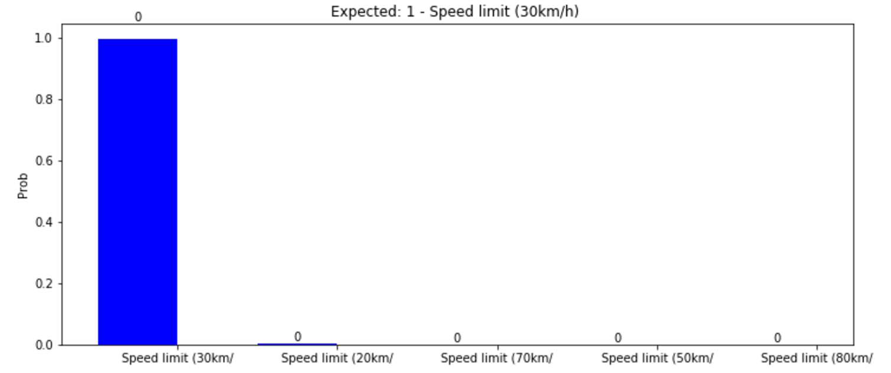

# **Traffic Sign Recognition** 

---

**Build a Traffic Sign Recognition Project**

The goals / steps of this project are the following:
* Load the data set (see below for links to the project data set)
* Explore, summarize and visualize the data set
* Design, train and test a model architecture
* Use the model to make predictions on new images
* Analyze the softmax probabilities of the new images
* Summarize the results with a written report


[//]: # (Image References)

## Rubric Points
Here I will consider the [rubric points](https://review.udacity.com/#!/rubrics/481/view) individually and describe how I addressed each point in my implementation.  

---
You're reading it! and here is a link to my [project code](https://github.com/matheuslrsouza/CarND-Traffic-Sign-Classifier-Project/blob/master/Traffic_Sign_Classifier.ipynb)

### Data Set Summary & Exploration

I used the numpy library to calculate summary statistics of the traffic
signs data set:

* The size of training set is **34799**
* The size of the validation set is **12630**
* The size of test set is **4410**
* The shape of a traffic sign image is **32x32**
* The number of unique classes/labels in the data set is **43**

Here is an exploratory visualization of the data set.


Number of images per sign

```
Speed limit (50km/h): 2010
Speed limit (30km/h): 1980
Yield: 1920
Priority road: 1890
Keep right: 1860
No passing for vehicles over 3.5 metric tons: 1800
Speed limit (70km/h): 1770
Speed limit (80km/h): 1650
Road work: 1350
No passing: 1320
Speed limit (100km/h): 1290
Speed limit (60km/h): 1260
Speed limit (120km/h): 1260
Right-of-way at the next intersection: 1170
General caution: 1080
Ahead only: 1080
No entry: 990
Stop: 690
Wild animals crossing: 690
Turn right ahead: 599
No vehicles: 540
Traffic signals: 540
Children crossing: 480
Slippery road: 450
Beware of ice/snow: 390
End of speed limit (80km/h): 360
Vehicles over 3.5 metric tons prohibited: 360
Turn left ahead: 360
Bumpy road: 330
Go straight or right: 330
Dangerous curve to the right: 300
Roundabout mandatory: 300
Double curve: 270
Keep left: 270
Road narrows on the right: 240
Bicycles crossing: 240
Pedestrians: 210
End of all speed and passing limits: 210
End of no passing: 210
End of no passing by vehicles over 3.5 metric tons: 210
Speed limit (20km/h): 180
Dangerous curve to the left: 180
Go straight or left: 180
```

### Design and Test a Model Architecture


As a first step, I decided to convert the images to grayscale to easy learning, since color does not affect in classification
Here is an example of a traffic sign image after grayscaling.


I decided to generate additional data to improve the performance of model, beacause the more examples we have, more the network can learn.
To add more data to the the data set, I used the techniques rotate, zoom and whitening.

Here is examples of augmented images:

**Rotate**


**Whitening**


After having generated the additional data, I extracted 10% of this data for validation, doing this I believe that the validation process becomes more accurate, by also validating the new images also.

Here is the code used for extract the data

```python
def extract_validation_data(x, y, x_valid, y_valid):
    
    # 10% for validation
    validation_count = int(len(x) * 0.1)

    #validTest = np.concatenate((validTest, x[-validation_count:]))
    new_x_valid = x[-validation_count:]
    new_y_valid = y[-validation_count:]
    
    new_x = x[:-validation_count]
    new_y = y[:-validation_count]
    
    new_x_valid = np.concatenate((x_valid, new_x_valid))
    new_y_valid = np.concatenate((y_valid, new_y_valid))
    
    return (new_x, new_y, new_x_valid, new_y_valid)
```

As a last step, I normalize the image data to prevent errors that happen when we work with very small and very large numbers

The difference between the original data set and the augmented data set is the following 

|Data            |Before augment     | After augment     |
|--------------|:-----------------:|:-----------------:|
|Trainig         |34799              |128759             |
|Validing        |12630              |23067              |
|                |                   |                   |
|                |                   |                   |
|                |                   |                   |


My final model consisted of the following layers:

| Layer         		|     Description	        					| 
|---------------------|:---------------------------------------------:| 
| Input         		| &nbsp;&nbsp;&nbsp;&nbsp;32x32x1 image   							    | 
| Convolution 5x5     	| &nbsp;&nbsp;&nbsp;&nbsp;1x1 stride, valid padding, outputs 28x28x6 	|
| RELU					|&nbsp;&nbsp;&nbsp;&nbsp;												|
| Max pooling	      	| &nbsp;&nbsp;&nbsp;&nbsp;2x2 stride, valid padding, outputs 14x14x6   	|
| Dropout               | &nbsp;&nbsp;&nbsp;&nbsp;0.7 keep_probability                          |
| Convolution 5x5	    | &nbsp;&nbsp;&nbsp;&nbsp;1x1 stride, valid padding, outputs 10x10x16	|
| RELU					|&nbsp;&nbsp;&nbsp;&nbsp;												|
| Max pooling	      	| &nbsp;&nbsp;&nbsp;&nbsp;2x2 stride, valid padding, outputs 5x5x16   	|
| Dropout               | &nbsp;&nbsp;&nbsp;&nbsp;0.7 keep_probability                          |
| Fully connected       | &nbsp;&nbsp;&nbsp;&nbsp;512                							|
| Dropout               | &nbsp;&nbsp;&nbsp;&nbsp;0.7 keep_probability                          |
| Fully connected       | &nbsp;&nbsp;&nbsp;&nbsp;120                							|
| Dropout               | &nbsp;&nbsp;&nbsp;&nbsp;0.7 keep_probability                          |
| Fully connected       | &nbsp;&nbsp;&nbsp;&nbsp;84                							|
| Dropout               | &nbsp;&nbsp;&nbsp;&nbsp;0.7 keep_probability                          |
| Softmax				| &nbsp;&nbsp;&nbsp;&nbsp;43        									|
|						|												|
|						|												|

Here is a diagram to illustrate the network architecture
 


To train the model, I used o AdamOptimizer com os hyperparameters abaixo

```
learning_rate = 0.001
epochs = 50
batch_size = 128
keep_probability = 0.7
```

My final model results were:
* training set accuracy of **0.952**
* validation set accuracy of **0.954**
* test set accuracy of **1.000**


First I chose the LeNet architecture without any change and got an accuracy of around 81%.
With this architecture the network was under fitting.

Being under fitting, I added dropouts between layers, this increased the accuracy a bit, but not as expected. I tried to increase the depth of the filters, and add more convolutions, but it did not work. From what I understand, this technique would work better if we had more data. When I created the additional data (zoom, whitennig and rotate), the performance increased, but still not enough.

I also tried to use the this [NVidia](https://devblogs.nvidia.com/parallelforall/deep-learning-self-driving-cars/) architecture, but I believe that because of the small amount of data it was not designed properly.

The first thing I tried was to adjust the learning rate between 0.0005 and 0.001. For the architecture chosen 0.001 was the best choice, but for architectures with more convolutions the learning rate 0.0005 worked better.
The batch_size that best fit was 128. With a larger number in the batch, I noticed that the processing gets faster, the model
begins with a higher accuracy, but depending on the number of training data, there comes a time when the model stops improving
faster resulting in under fitting.

In the end, what was most efficient was to use the LeNet architecture as a base, add dropouts between the layers and a fully connected layer of 512 just after the last convolution. I could see that for a not so large amount of data a fully connected layer works better than convolutions and does not leave the network slow, as opposed to the convolutions layer that add much more parameters leaving the training process slow.

### Test a Model on New Images

Here are five German traffic signs that I found on the web:


         

Here are the results of the prediction:

| Image			        |     Prediction	        					| 
|:---------------------:|:---------------------------------------------:| 
| Stop Sign      		| Stop sign   									| 
| Children crossing    	| Children crossing 							|
| Yield					| Yield											|
| Speed limit (30km/h)	| Speed limit (30km/h)			 				|
| Bumpy road			| Bumpy road      								|
|						|												|
|						|												|
|						|												|
|						|												|


The model was able to correctly guess 5 of the 5 traffic signs, which gives an accuracy of 100%. 
Analyzing the accuracy and recall of test data, we can see that the network is ranking very well the 5 chosen images


| Image			        |     Precsion 						|        Recall				| 
|:---------------------:|:---------------------------------:|:-------------------------:|
| **Stop Sign**      	|&nbsp;&nbsp;&nbsp;&nbsp;0.97 Correct: 89 - Error: 3	|&nbsp;&nbsp;&nbsp;&nbsp;0.99 (89/90) Error: 1|
| **Children crossing**	|&nbsp;&nbsp;&nbsp;&nbsp;0.95 Correct: 60 - Error: 3	|&nbsp;&nbsp;&nbsp;&nbsp;1.00 (60/60) Error: 0|
| **Yield**      		|&nbsp;&nbsp;&nbsp;&nbsp;0.98 Correct: 238 - Error: 5	|&nbsp;&nbsp;&nbsp;&nbsp;0.99 (238/240) Error: 2|
| **Speed limit (30km/h)** |&nbsp;&nbsp;&nbsp;&nbsp;0.98 Correct: 228 - Error: 4|&nbsp;&nbsp;&nbsp;&nbsp;0.95 (228/240) Error: 12|
| **Bumpy road**      	|&nbsp;&nbsp;&nbsp;&nbsp;1.00 Correct: 60 - Error: 0	|&nbsp;&nbsp;&nbsp;&nbsp;1.00 (60/60) Error: 0|
||||
||||
||||


The code for making predictions on my final model is located in the 34th cell of the Ipython notebook.

Here is the print of **tf.nn.top_k** function

```python
TopKV2(values=array([[  1.00000000e+00,   0.00000000e+00,   0.00000000e+00,
          0.00000000e+00,   0.00000000e+00],
       [  1.00000000e+00,   1.36969754e-16,   8.64612615e-24,
          1.01504971e-24,   5.33924711e-27],
       [  1.00000000e+00,   4.52336185e-28,   1.61126451e-32,
          2.05115820e-34,   3.47249472e-37],
       [  9.97221231e-01,   2.75196019e-03,   1.61141907e-05,
          1.07141350e-05,   2.90366065e-10],
       [  1.00000000e+00,   0.00000000e+00,   0.00000000e+00,
          0.00000000e+00,   0.00000000e+00]], dtype=float32), indices=array([[14,  0,  1,  2,  3],
       [13, 22, 29, 26, 35],
       [28, 29, 20, 24, 23],
       [ 1,  0,  4,  2,  5],
       [22,  0,  1,  2,  3]], dtype=int32))
```

For the first image, the model is really sure that this is a stop sign (probability of 1.0), and the image does contain a stop sign. The top five softmax probabilities were

| Probability         	|     Prediction	        					| 
|:---------------------:|:---------------------------------------------:| 
| 1.0         			| Stop sign   									| 
| 0.0     				| Speed limit (20km/h) 							|
| 0.0					| Speed limit (30km/h)							|
| 0.0	      			| Speed limit (50km/h)			 				|
| 0.0				    | Speed limit (60km/h)      					|
|||
|||
|||


For the second image, the model is really sure that this is a yield sign (probability of 1.0), and the image does contain a yield sign. The top five softmax probabilities were

| Probability         	|     Prediction	        					| 
|:---------------------:|:---------------------------------------------:| 
| 1.0         			| Yield   										| 
| 0.0     				| Bumpy road 									|
| 0.0					| Bicycles crossing								|
| 0.0	      			| Traffic signals			 					|
| 0.0				    | Ahead only      								|
|||
|||
|||


In the same way on third image, the model is sure that this is a Children crossing sign (probability of 1.0), and it's correct. The top five softmax probabilities were

| Probability         	|     Prediction	        					| 
|:---------------------:|:---------------------------------------------:| 
| 1.0         			| Children crossing   							| 
| 0.0     				| Bicycles crossing 							|
| 0.0					| Dangerous curve to the right					|
| 0.0	      			| Road narrows on the right	 					|
| 0.0				    | Slippery road    								|
|||
|||
|||


For the Speed limit 30km, the model did a really good prediction (probability of .99). The top five softmax probabilities were

| Probability         	|     Prediction	        					| 
|:---------------------:|:---------------------------------------------:| 
| .99         			| Speed limit (30km/h)   						| 
| 0.0027   				| Speed limit (20km/h) 							|
| 0.0					| Speed limit (70km/h)							|
| 0.0	      			| Speed limit (50km/h)	 						|
| 0.0				    | Speed limit (80km/h)    						|
|||
|||
|||




For the last image, the model is sure that this is a Bumpy road sign (probability of 1.0), and it's correct. The top five softmax probabilities were

| Probability         	|     Prediction	        					| 
|:---------------------:|:---------------------------------------------:| 
| 1.0         			| Bumpy Road 		  							| 
| 0.0     				| Speed limit (20km/h) 							|
| 0.0					| Speed limit (30km/h)							|
| 0.0	      			| Speed limit (50km/h)			 				|
| 0.0				    | Speed limit (60km/h)      					|
|||
|||
|||


### (Optional) Visualizing the Neural Network (See Step 4 of the Ipython notebook for more details)

In the first layer, seems that the model learns shapes (borders). 


And in the second layer, the model learns from fragments.

